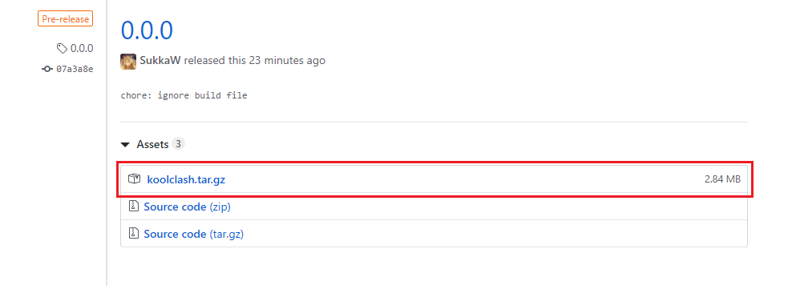
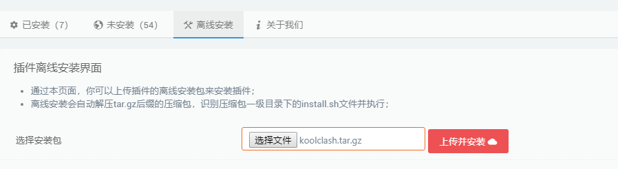
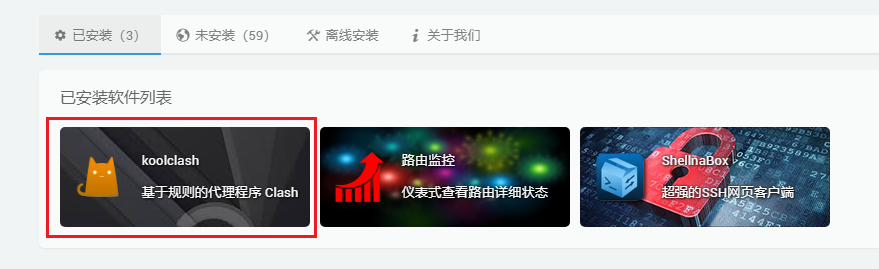

# 安装

## 下载

在 [GitHub Release](https://github.com/SukkaW/Koolshare-Clash/releases/) 页面，找到「Assets」中的 `koolclash.tar.gz`，点击下载。

## 安装

前往 Koolshare OpenWrt/LEDE 的管理页面，点击左侧的「酷软」进入「koolshare Openwrt 软件中心」。点击「离线安装」选项卡，选择 `koolclash.tar.gz`，点击「上传并安装」。

等待安装完成，页面会自动跳转，在软件列表中找到 koolclash，点击进入。

