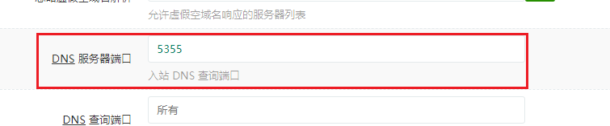
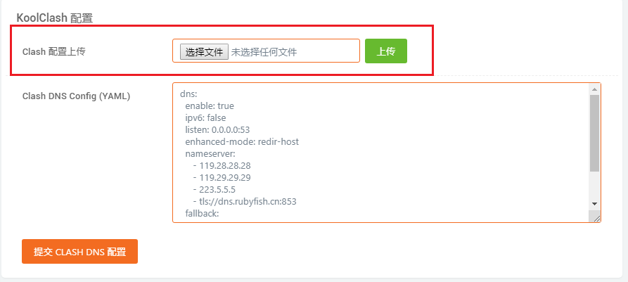

# 使用教程

## 修改 dnsmasq 监听端口

Clash 的规则依赖 Clash 接管 DNS 解析，所以首先需要修改 LEDE/OpenWrt 中 dnsmasq 监听的端口。在「网络 - DHCP/DNS - 服务器设置 - 高级设置」中，找到「DNS 服务器端口」，修改为除了 53 以外任何不冲突的端口，「保存并应用」。



!> 如果（有很大可能性）你的 DNS 设置为 LEDE/OpenWrt 的 IP，那么这项操作会立刻影响到你的互联网连接（无法正常进行域名解析）你可以修改你的 DNS 设置。  
但是在启用 KoolClash 以后应该将 DNS 设置为 LEDE/OpenWrt 的 IP。

## 上传 Clash 配置文件

选择 Clash 配置文件并点击右侧的「上传」即可上传 Clash 配置文件到 KoolClash 中。



?> KoolClash 尚不支持自动从托管配置自动下载更新 Clash 配置文件，需要用户自行手动上传。

## 设置 Clash DNS 配置

如果你正在使用的是由公共代理服务提供商提供的客户端配置，且没有关于 DNS 的设置，你可以添加 DNS 配置。


以下是一个 DNS 配置的示范：

```yaml
dns:
  enable: true
  listen: 0.0.0.0:53
  enhanced-mode: redir-host
  # 当访问一个域名时，Clash 会向 nameserver 与 fallback 列表内的所有服务器并发请求，得到域名对应的 IP 地址
  # Clash 将选取 nameserver 列表内解析最快的结果
  nameserver:
    - 119.29.29.29
    - 119.28.28.28
    - 223.6.6.6
    - 223.5.5.5
    - tls://dns.rubyfish.cn:853
  # 若 nameserver 列表内的服务器返回的解析结果中，IP 地址属于 国外，那么 Clash 将选择 fallback 列表内，解析最快的结果
  fallback:
    - tls://dns.google
    - tls://1dot1dot1dot1.cloudflare-dns.com

# (1) 如果您为了确保 DNS 解析结果无污染，请仅保留列表内以 tls:// 开头的 DNS 服务器，但是通常对于国内没有太大必要
# (2) 如果您不在乎可能解析到污染的结果，更加追求速度。请将 nameserver 列表的服务器插入至 fallback 列表内，并移除重复项
# (3) 在 Clash 的 DNS 支持 dns2docks 之前，不建议在 fallback 中使用常规方式进行解析（即直接配置 IP）
```

KoolClash 会自动检查你上传的 Clash 配置文件有没有包含 DNS 配置，只有目前 Clash 配置文件中没有包含 DNS 配置时才会将你提交的 DNS 配置附在 Clash 配置文件之中。

?> 提交完 DNS 配置以后，建议重新上传一次 Clash 配置文件。

## 启动 Clash

配置好以后，可以点击「启动/重启 Clash」启动 Clash。通过检查「Clash 运行状态」和「IP 地址检查 & 网站访问检查」来判断代理运行状态。
